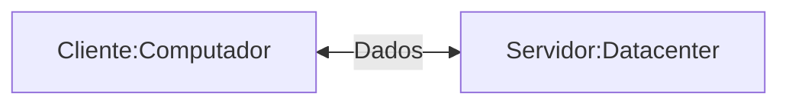
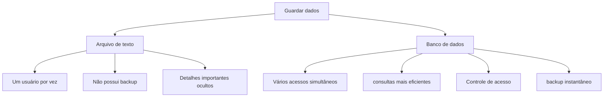
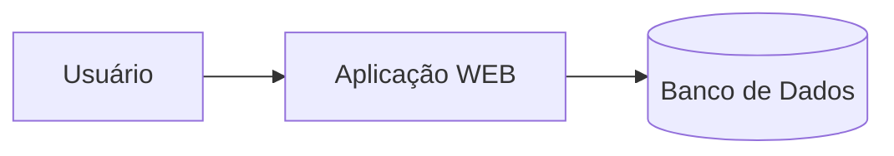
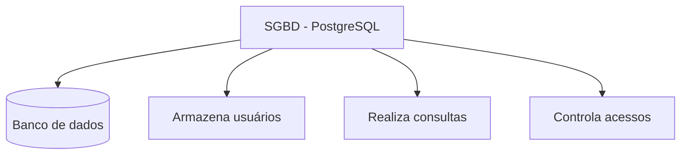

## Servidor de Desenvolvimento
será uma interface de desenvolvimento, para projetar aplicações e banco de dados


---
## Servidor de Arquivos Educacional
É um servidor para armazenar arquivos e facilitar na hora de realizar a transferência.

>O endereço para acesso ao servidor de arquivos é: `\\10.87.36.10`.

>Credenciais de acesso: `Email: aluno, Senha: aluno`.

---
O Moba será a interface para acesso ao meu servidor de desenvolvimento.
>O acesso, será realizado via SSH.

>Credenciais de acesso: IP: `192.168.10.81`, Username: `root` e Porta: `2222`

Para o primeiro acesso utilizamos a senha `aluno01`

Para alterar a senha, utilizamos o comando:
```bash
passwd
```
Para visualizar os recursos do meu servidor utilizamos o comando: 
```bash
htop
```
---
|Recurso|Configuração|
|----|-------|
|Processador|2 cores|
|RAM|512MB|
|Armazenamento|6 GB|
|Sistema Operacional|Ubuntu 26.04 LTS|
---
A utilização de um servidor de desenvolvimento, simula um ambiente real de produção.

Os objetivos esperados são:

- Deploy de projetos,
- Aplicação de banco de dados,
- Experiência real de mercado

## Banco de Dados
Antigamente os dados eram salvos em arquvos/planilhas.


---
>mas afinal, onde entra o banco de dados em aplicações WEB?


## SGBD
Sistema Gerenciador de Banco de Dados.

>Função: Gerenciar, controlar e permitir consulas nos nossos bancos de dados.


---
