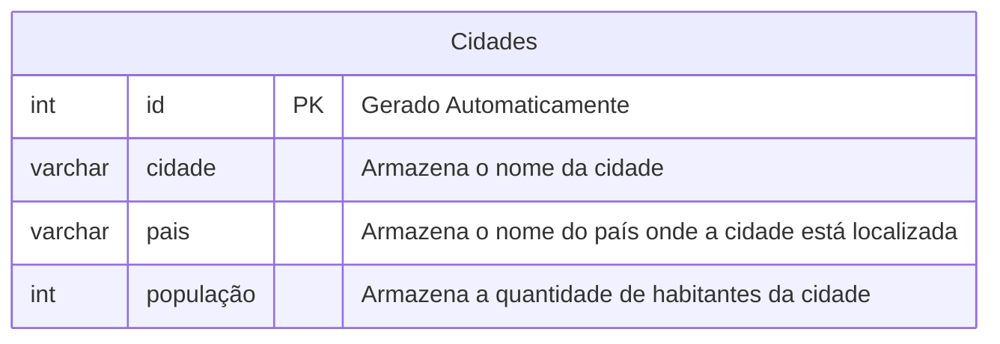

## Atividade Banco de Dados - Cidades

**Criando o banco de dados**

Acessar o arquivo main com o comando:
`cd /etc/postgresql/18/main`
 
 Executar o comando:
 `sudo -u postgres psql`
 
 Como postgres, criar o banco de dados com o comando:
 `CREATE DATABASE Cidades;`


---
**Modelar o banco de dados**


---


```sql

```