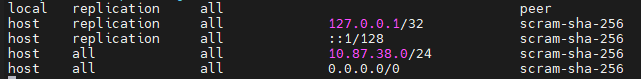
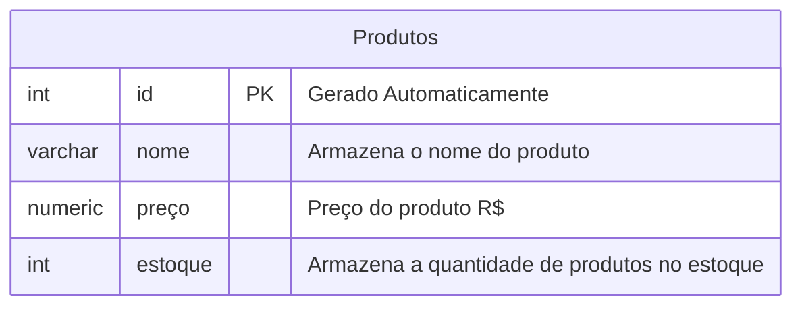

## Aula 04
Alteração de parâmetros dos arquivos de configuração:



---

Para excluir um banco de dado, utilizamos o comando:
```sql
DROP DATABASE cidades;
```
>Cuidado na operação! Não é possível recuperar os dados apagados.
---
Primeiro iniciamos o processo criando um novo banco de dados:
```sql
CREATE DATABASE loja;
```

---
**Modelando o primeiro banco de dados**

Para criação do banco de dados, utilizamos os seguintes comandos:

```sql
CREATE TABLE produtos(
    id INT GENERATED ALWAYS AS IDENTITY NOT NULL,
    nome VARCHAR(50) NOT NULL,
    preço NUMERIC(10,2) NOT NULL,
    estoque INT NOT NULL DEFAULT 0
);
```

Para consultar todos os dados da tabela:
```sql
SELECT * FROM produtos;
```

