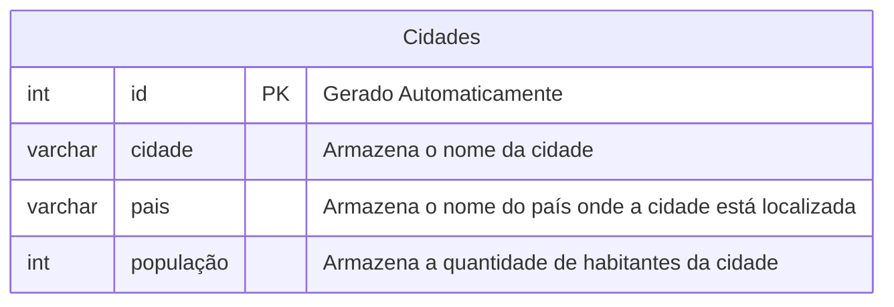

## Atividade Banco de Dados - Cidades

**Criando o banco de dados**

Acessar o arquivo main com o comando:
`cd /etc/postgresql/18/main`
 
 Executar o comando:
 `sudo -u postgres psql`
 
 Como postgres, criar o banco de dados com o comando:
 `CREATE DATABASE Cidades;`


---
**Modelar o banco de dados**


---


```sql
INSERT INTO cidades_mais_ricas (nome_cidade, pais, populacao) VALUES
('Nova York', 'Estados Unidos', 8258035),
('Tóquio', 'Japão', 13960000),
('São Francisco', 'Estados Unidos', 808437),
('Londres', 'Reino Unido', 8866180),
('Singapura', 'Singapura', 5917600),
('Los Angeles', 'Estados Unidos', 3822238),
('Pequim', 'China', 21893095),
('Xangai', 'China', 24870895),
('Sydney', 'Austrália', 5312163),
('Hong Kong', 'China', 7346100);

```

-- Consulta 1: Retorna todos os registros cadastrados na tabela
SELECT * FROM cidades_mais_ricas;

-- Consulta 2: Retorna as cidades ordenadas da maior para a menor população
SELECT 
    id, 
    nome_cidade, 
    pais, 
    populacao 
FROM cidades_mais_ricas 
ORDER BY populacao DESC;