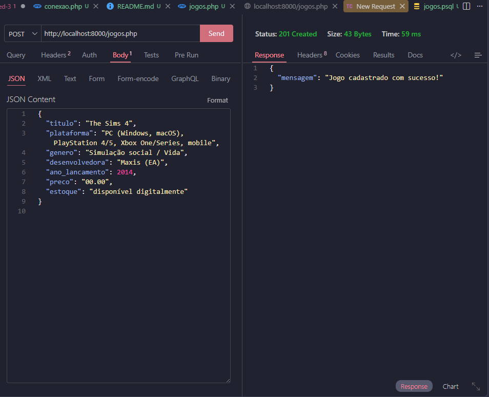
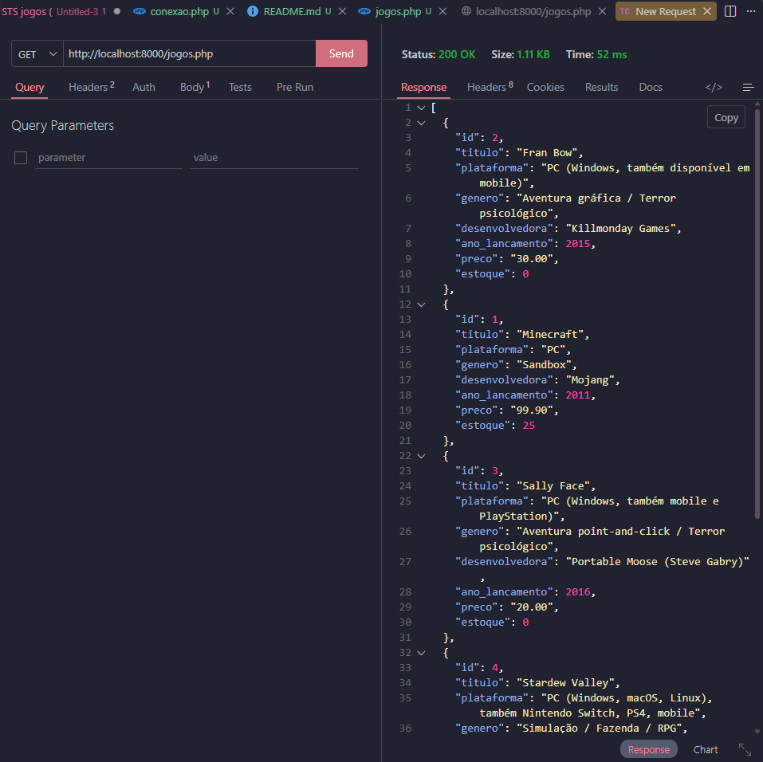
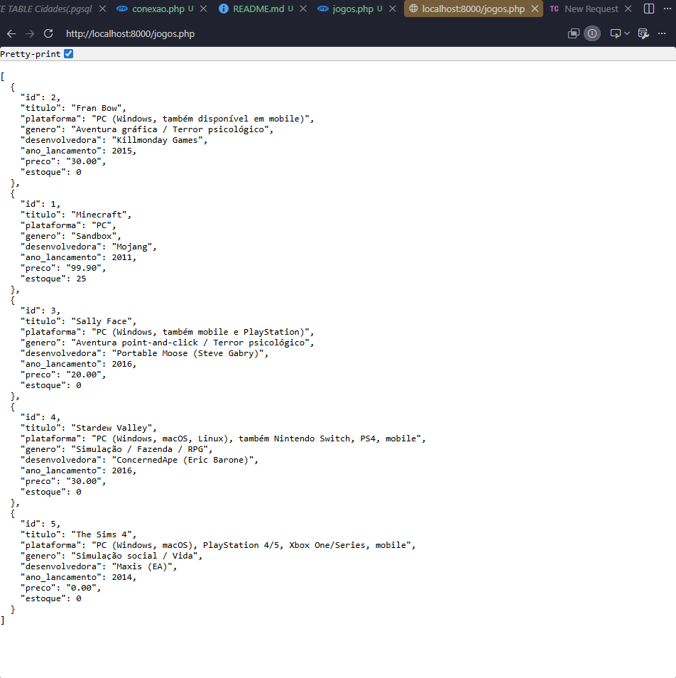
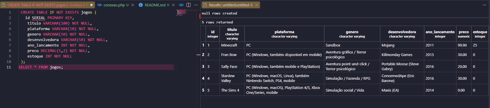

# Criação de API REST com SQL

### ATIVIDADE – API DE CATÁLOGO DE GAMES 

A Level Up Games é uma loja de jogos que vende pelo site e pelo Instagram. O problema: cada canal usa uma lista diferente, e na última promoção a loja vendeu jogos que já estavam esgotados. Sua missão é criar a API que vai centralizar o catálogo, usando como base a API de produtos feita em aula.

1) BANCO DE DADOS
Crie o banco "levelup" e a tabela "jogos" com as colunas:
id, titulo, plataforma, genero, desenvolvedora, ano_lancamento, preco, estoque
Atenção aos tipos: ano e estoque são números inteiros; o preço tem casas decimais.

2) CONEXÃO
Ajuste o conexao.php para se conectar ao banco "levelup".

3) API (arquivo jogos.php)
POST: cadastra um jogo e responde {"mensagem": "Jogo cadastrado com sucesso!"}
GET: lista todos os jogos em ordem alfabética pelo título.

4) TESTES
Cadastre 5 jogos que você gosta. Exemplo de JSON:
{
  "titulo": "Minecraft",
  "plataforma": "PC",
  "genero": "Sandbox",
  "desenvolvedora": "Mojang",
  "ano_lancamento": 2011,
  "preco": 99.90,
  "estoque": 25
}
Lembre-se: em JSON, número decimal usa ponto (99.90), não vírgula.

**ENTREGA**
Anexe o comando SQL da tabela, os arquivos conexao.php e jogos.php, um print do POST e um print do GET.
---

### CREATE TABLE
```pgsql
 CREATE TABLE IF NOT EXISTS jogos (
   id SERIAL PRIMARY KEY,
    titulo VARCHAR(100) NOT NULL,
    plataforma VARCHAR(50) NOT NULL,
    genero VARCHAR(50) NOT NULL,
    desenvolvedora VARCHAR(50) NOT NULL,
    ano_lancamento INT NOT NULL,
    preco DECIMAL(5,2) NOT NULL,
    estoque INT NOT NULL
 );
SELECT * FROM jogos;

```


### conexao.php
```php
<?php
$host = "192.168.10.81";
$port = "5432";
$banco = "levelup";
$usuario = "postgres";
$senha = "Camile07122009";

try {
    $pdo = new PDO("pgsql:host=$host;port=$port;dbname=$banco", $usuario, $senha);
    $pdo->setAttribute(PDO::ATTR_ERRMODE, PDO::ERRMODE_EXCEPTION);
    $pdo->setAttribute(PDO::ATTR_DEFAULT_FETCH_MODE, PDO::FETCH_ASSOC);
} catch (PDOException $e) {
    die("Erro de conexão: " . $e->getMessage());
}
?>

```

### jogos.php
```php
<?php

header("Content-Type: application/json; charset=UTF-8");
header("Access-Control-Allow-Origin: *");
header("Access-Control-Allow-Methods: GET, POST");
header("Access-Control-Allow-Headers: Content-Type");

require_once("conexao.php");

$metodo = $_SERVER["REQUEST_METHOD"];

if ($metodo === "POST") {
    $json = file_get_contents("php://input");
    $dados = json_decode($json, true);

    // Valida se o JSON foi recebido corretamente e se todos os campos estão presentes
    if (
        !$dados || 
        !isset(
            $dados["titulo"], 
            $dados["plataforma"], 
            $dados["genero"], 
            $dados["desenvolvedora"], 
            $dados["ano_lancamento"], 
            $dados["preco"], 
            $dados["estoque"]
        )
    ) {
        http_response_code(400);
        echo json_encode(["erro" => "Dados incompletos ou JSON inválido."]);
        exit;
    }

    // Insere o jogo no banco de dados com 7 marcadores de posição
    $sql = "INSERT INTO jogos (titulo, plataforma, genero, desenvolvedora, ano_lancamento, preco, estoque) 
            VALUES (?, ?, ?, ?, ?, ?, ?)";
    
    $comando = $pdo->prepare($sql);

    $comando->execute([
        $dados["titulo"],
        $dados["plataforma"],
        $dados["genero"],
        $dados["desenvolvedora"],
        (int)$dados["ano_lancamento"],
        (float)$dados["preco"],
        (int)$dados["estoque"]
    ]);

    http_response_code(201);
    echo json_encode([
        "mensagem" => "Jogo cadastrado com sucesso!"
    ]);
    exit;
}

if ($metodo === "GET") {
    // Retorna todos os jogos em ordem alfabética pelo título
    $sql = "SELECT * FROM jogos ORDER BY titulo ASC";
    $stmt = $pdo->prepare($sql);
    $stmt->execute();
    
    $jogos = $stmt->fetchAll();

    http_response_code(200);
    echo json_encode($jogos);
    exit;
}

// Retorno caso utilize um método não permitido (PUT, DELETE, etc.)
http_response_code(405);
echo json_encode(["erro" => "Método não permitido."]);
?>

```
---

### POST


### GET


### localhost:8000/jogos.php


### Tabela
