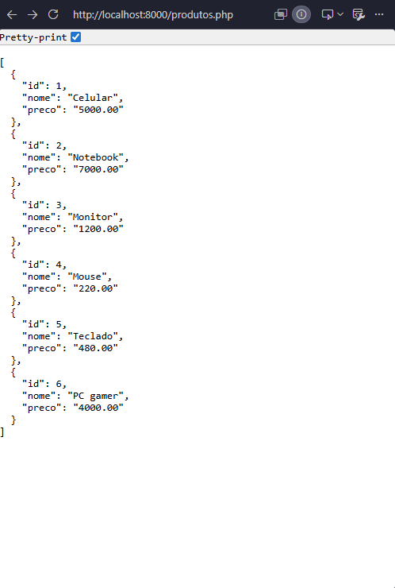
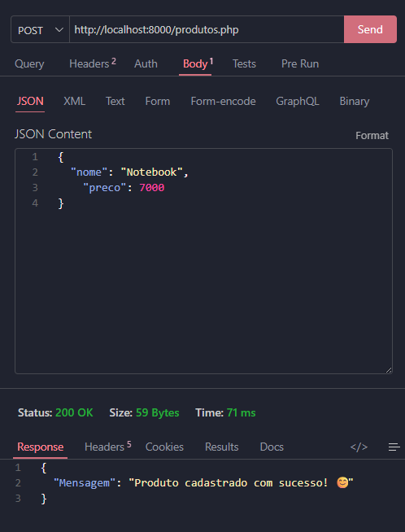

## Configurando o SGBD
SGBD: Sistema Gerenciador de Banco de Dados

Para instalação utilizamos o comando: 
```bash
sudo apt install -y postgresql
```
>No meu servidor como eu já estava como root, não foi necessário o sudo.

Para acesso inicial utilizamos o comando: 
```bash 
sudo -u postgres psql
```
>Autenticação via Linux, não necessita de senha, pois você já está autenticado.

Após primeiro acesso alteramos a senha, através do comando: 
```sql
ALTER USER postgres PASSWORD '----';
```
>SQL: Comandos em SQL, letras maiúsculas.

Para sair do SGBD, utilizamos o comando `\q`

Para acesso externo, utilizamos o comando:
```bash
sudo psql -h 127.0.0.1 -U postgres
```
>Aqui, ele vai necessitar uma senha!

Alterações dos arquivos
1. Navegamos até o caminho:
```bash
cd /etc/postgresql/18/main
```


2. Editamos o arquivo postgresql.confd através do comando:
```bash
sudo nano postgresql.conf
```
Linha listen_addresses = '*'
>Para pesquisar a linha: Ctrl + W

3. Segunda alteração no arquivo pg_hba.conf:
```bash 
sudo nano pg_hba.conf
```
>Para ir para o final do arquivo: Ctrl + End (pode ser necessário utilizar o fn também)

4. Alterações realizadas:



>`Porque o 0.0.0.0?` O número 0 é um número neutro, então permite que todos possam acessar.
---
### 1º Comando de SQL:
 
 ```sql
 CREATE DATABASE 
 ```
 →\L = Lista todos os bancos de dados!
 ```bash
 sudo systemctl restart postgresql
 ```
 ⤿ Restarta a aplicação

```bash
sudo systemctl status postgresql
```
⤿ Verifica o status da aplicação

```bash
sudo systemctl start postgresql
```
⤿ Começa a aplicação, utilizado quando o "status" não funciona

```bash
pg_lsclusters
```
---
```sql
5432 → Porta padrão
```

```mermaid
SELECT * FROM produtos;

SELECT nome,preço FROM produtos;

SELECT * FROM produtos WHERE estoque < 15;

SELECT * FROM produtos
ORDER BY preço DESC ou ASC;

SELECT * FROM produtos WHERE nome='Lustre';

UPDATE produtos
SET preço=5000 WHERE nome='Lustre';

DELETE FROM produtos
WHERE nome='Torneira';

DELETE FROM produtos WHERE id IN (1,2,3);
```

```mermaid
DROP DATABASE nome

DROP DATABASE IF EXITS nome
```
```mermaid 
-- criação de tabela
CREATE TABLE produtos(
    id SERIAL PRIMARY KEY,
    nome VARCHAR(100) NOT NULL,
    categoria VARCHAR(50) NOT NULL,
    preco DECIMAL(10,2) NOT NULL,
    estoque INTEGER NOT NULL
);
```

### Adicionando produtos em lista BCD (thunderclient)

Produtos (pasta)
|
---conexao.php (file)
|
---produtos.php (file)

**conexao.php**
```php
//conexao.php
<?php

$host = "192.168.10.81";
$usuario = "postgres";
$banco = "lojasenai";
$senha = "Camile07122009";

$pdo = new PDO(
    "pgsql:host=$host;port=5432;dbname=$banco",
    $usuario,
    $senha
);
```
**produtos.php**
```php
//produtos.php
<?php

header("Content-Type: application/json");

require "conexao.php";

$metodo = $_SERVER["REQUEST_METHOD"];

if($metodo == "POST"){
    $json = file_get_contents("php://input");

    $dados = json_decode($json,true);

    $sql = "INSERT INTO produtos (nome,preco) VALUES (?,?)";

    $comando = $pdo -> prepare($sql);

    $comando -> execute([
        $dados["nome"],
        $dados["preco"]
    ]);

    echo json_encode([
        "Mensagem"=>"Produto cadastrado com sucesso! 😊"
    ]);
}

if($metodo == "GET"){
    $sql = "SELECT * FROM produtos ORDER BY id";

    $comando = $pdo -> query($sql);

    $produtos = $comando -> fetchAll(PDO::FETCH_ASSOC);

    echo json_encode($produtos);
}
```

**No terminal**
php -S localhost:8000
╰› rodar o servidor 

**Rodando**

╰› adicionar produtos.php no final

**No postgres**
CREATE TABLE produtos(
    id SERIAL PRIMARY KEY,
    nome VARCHAR(50) NOT NULL,
    preco NUMERIC(10,2) NOT NULL
);

**No thunderclient**


**New Query**
╰› SELECT * FROM produtos;

---